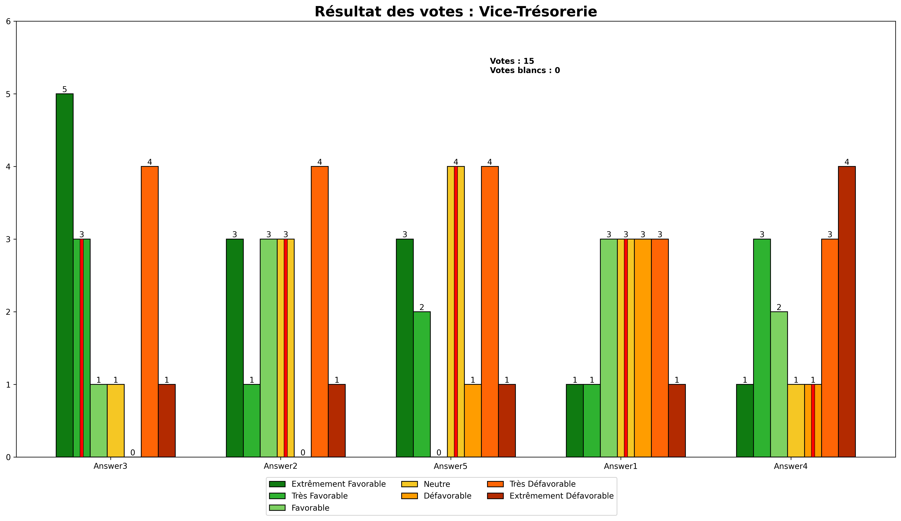

# Dépouillage des votes

<span>

</span>


Ceci est un code qui permet de mettre en forme les résultats de votes récupérés suite à un vote utilisant Bélénios. <br />
Le vote se fait par la méthode du vote majoritaire, et le départage des égalité se fait par la méthode récursive de retrait du vote médian : <br />
&nbsp;&nbsp;&nbsp;&nbsp;&nbsp;&nbsp;&nbsp;&nbsp;https://fr.wikipedia.org/wiki/Jugement_majoritaire#Méthode_récursive_de_retrait_du_vote_médian


## Installation

Clonez le git, lancez le programme :+1:

## Explications

### Le format des votes

Une fois récupérez sur Bélénios, les votes sont récupérés sous cette forme :
```
[[[note * nombre de candidat] * nombre de votes] * nombre de questions]
```
Vous pouvez trouvez un exemple avec le fichier [result.json](./result.json)

## Utiliser l'application

A la fin de la page de dépouillage des votes de Bélénios, vous trouvez un bouton `raw results` qui permet de télécharger le fichier des résultats ([result.json](./result.json)) et il vous faudra le mettre dans le même dossier que le programme.

Vous pouvez paramètrer la liste des rôles pour 
```python
roles = ["Présidence", "Vice-Présidence", "Trésorerie", "Vice-Tésorerie", "Secrétariat"]
```

<br />

De même, les candidats à l'élection sont définis au début du fichier, dans l'ordre des postes :
```python
candidatss = [
    ["Answer 1", "Answer 2", "Answer 3"],
    ["Answer 1", "Answer 2", "Answer 3"],
    ["Answer 1", "Answer 2", "Answer 3", "Answer 4"],
    ["Answer 1", "Answer 2", "Answer 3", "Answer 4", "Answer 5"],
    ["Answer 1", "Answer 2"]
]
```
### <u> /!\ ATTENTION /!\ </u>
Les postes doivent être dans le même ordre que les questions posées sur Bélénios et le nom des candidats doit être le même que dans les questions sur Bélénios.
### <u> /!\ ATTENTION /!\ </u>

### Les résultats

Les résultats sont donnés sous trois formes

- Un fichier [resume.txt](./debug/resume.txt) qui est l'équivalent des `print` du terminal;
- Un fichier [debug.txt](./debug//resume.txt) qui est le même  que le fichier précédent, mais avec plus de précision sur certains points (notament la gestion des égalités entre médianes);
- Des [graphiques](./graphs/) crée par le programme donnant les résultats avec les candidats classés et divers autres informations. Résultat avec les données de test :

