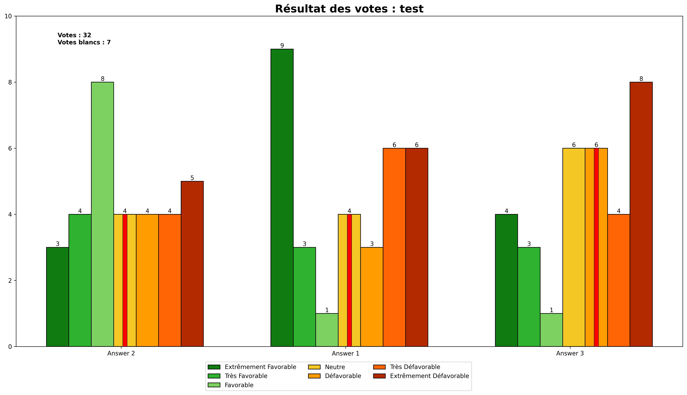

# Dépouillage des votes

<span>

</span>


Ceci est un code qui permet de mettre en forme les résultats de votes récupérés suite à un vote utilisant Bélénios. <br />
Le vote se fait par la méthode du vote majoritaire, et le départage des égalité se fait par la méthode récursive de retrait du vote médian : <br />
&nbsp;&nbsp;&nbsp;&nbsp;&nbsp;&nbsp;&nbsp;&nbsp;https://fr.wikipedia.org/wiki/Jugement_majoritaire#Méthode_récursive_de_retrait_du_vote_médian


## Installation

Clonez le git, lancez le programme :+1:

## Utiliser l'application

### Le format des votes

Une fois récupérez sur Bélénios, les votes sont récupérés sous cette forme :
```
[[note * nombre de candidat] * nombre de votes]
```
Vous pouvez trouvez un exemple avec le fichier [resultats-test.json](./resultats-test.json)

<br />

Il faut avoir <b>5</b> fichiers `.json` au nom des postes que l'on peut paramètrer ici :
```python
roles = ["Présidence", "Vice-Présidence", "Trésorerie", "Vice-Tésorerie", "Secrétariat"]
```

<br />

Les candidats à l'élection sont définis au début du fichier :
```python
candidatss = [
    ["Answer 1", "Answer 2", "Answer 3"],
    ["Answer 1", "Answer 2", "Answer 3"],
    ["Answer 1", "Answer 2", "Answer 3"],
    ["Answer 1", "Answer 2", "Answer 3"],
    ["Answer 1", "Answer 2", "Answer 3"]
]
```


### Les résultats

Les résultats sont donnés sous trois formes

- Un fichier [resume.txt](./resume.txt) qui est l'équivalent des `print` du terminal;
- Un fichier [debug.txt](./debug.txt) qui est le même  que le fichier précédent, mais avec plus de précision sur certains points (notament la gestion des égalités entre médianes);
- Un [graphique](./test.png) crée par le programme donnant les résultats avec les candidats classés et divers autres informations. Résultat avec les données de test :

